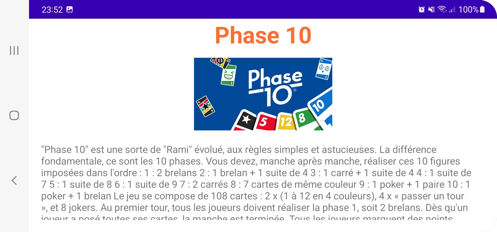

# BoardingDraft

Cette application a été développée en **Kotlin** lors d'un projet Android de 3ème année à l'ISIMA.

### Spécifications techniques :
* Développé sur : Android Studio Arctic Fox | 2020.3.1 Patch 4
* Version plugin de Kotlin : 203-1.5.20-release-289-AS7717.8
* Android SDK : 32

---

### Présentation du projet :
Le but final de ce projet était de mettre en place une application pour téléphone :iphone:, permettant à des personnes de voter pour le jeu de société auquel ils souhaiteraient jouer.
Chacun leur tour, elles prennent le téléphone pour sélectionner les jeux qu'elles préfèrent.

Le processus devait être le suivant :
* Lors de l'ouverture de l'application, ajout des différentes personnes présentes pour jouer.
* Lancement des votes. A tour de rôle, les personnes présentes, votent pour le(s) jeu(x) voulu(s).
* A la fin des votes, une page de résultats affiche les jeux triés par ordre décroissant du nombre de votes reçus.
* Les joueurs n'ont plus qu'à faire une partie du jeu gagnant.
* :warning: **Attention : les différents jeux proposés ne sont pas disponibles directement dans notre application.** :warning:

---

### Objectifs :
Pour ce projet, nous devions au minimum mettre en place les éléments suivants :
* Une **liste**.
* Un écran pour afficher les **détails** d'un élément de la liste.
* Utiliser un **ViewModel**.
* Utiliser une **coroutine**.
* Utiliser une **API** pour aller chercher des données sur Internet.
* Faire de la **sauvegarde de données**.
* Prendre en charge le **changement d'orientation** de l'écran.

---

### Réalisations :
Même si nous avons réussi à mettre en place toutes les fonctionnalités demandées, par manque de temps nous n'avons pas réalisé tout ce que nous voulions faire. Les différentes captures d'écrans ci-dessous, vous présentent les pages qu'il y a actuellement dans l'application.

    
    

Ce 1er écran est l'écran d'accueil de notre application. C'est depuis celui-ci que nous avons la possibilité d'ajouter ou de supprimer les joueurs présents pour la partie. Ces différents prénoms sont sauvegardés dans une base de données locale, ce qui permet de les récupérer lors d'une prochaine ouverture de l'application. Les utilisateurs ont aussi la possibilité de parcourir la liste des jeux disponibles dans l'application et de lancer les votes, en cliquant sur les boutons adéquats.

  

    
    

Ici, nous pouvons voir la liste de différents jeux :game_die: présents dans l'application et pour lesquels il est possible d'avoir des informations et les règles en cliquant dessus. Cette page d'informations est présentée par les captures suivantes :

    
    

  
C'est sur cette dernière page que les différents joueurs devaient pouvoir voter les uns après les autres. Pour chacun d'eux, une liste des jeux disponibles devait s'afficher avec la possibilité de sélectionner jusqu'à 3 jeux. Lorsque toutes les personnes avaient voté, une autre page devait apparaître avec les résultats des votes. N'ayant pas le temps de réaliser tout cela, nous avons décidé de mettre en place l'API demandée. Cette dernière nous permet d'aller chercher, de façon aléatoire, une image de chaton :cat: sur Internet :spider_web:. Une nouvelle image apparaît lorsque l'on arrive sur cet écran et à chaque fois que l'on clique sur le bouton prévu à cet effet. Si la connexion à Internet ne se fait pas, alors c'est une image par défaut qui est affichée :lizard:.

    
    
    

   
Pour finir, voici l'architecture logicielle que nous avons mise en place :

    

Cette architecture est découpée en 2 parties :
* Le **FrontEnd** composé : des différentes _Activity_ et _Fragment_ et du _ViewModel_
* Le **BackEnd** composé : du _Repository_, de la _DAL_ et de la _base de données_

La mise en place du **ViewModel**, sert non seulement de point d'entrée à la récupération des données, mais permet aussi de gérer correctement le cycle de vie des _Activity_ et des _Fragment_ et ainsi gérer les changements de configurations, comme par exemple la rotation de l'écran.

---

### Améliorations possibles :
* Développer le reste de l'application (votes des joueurs ; résultats des votes)
* Mettre un système pour ajouter / supprimer des jeux (actuellement tout ce fait lors de l'installation de l'application sur le téléphone)
* Mettre un ComboBox sur la page d'accueil, pour sélectionner la langue d'affichage (Français :fr: ou Anglais :uk: pour l'instant)
* Mettre une musique d'ambiance :musical_note:
* Mettre plus de jeux dans la BDD

 
Développeurs :

    - BECOUZE Florent
    - GOUEZ Virgil
    
    Filière 1 : Informatique des systèmes pour l'embarqué, la robotique et le virtuel
    
 
 
Professeurs :

    - COULANGE Thomas
    - GOUTET Olivier
